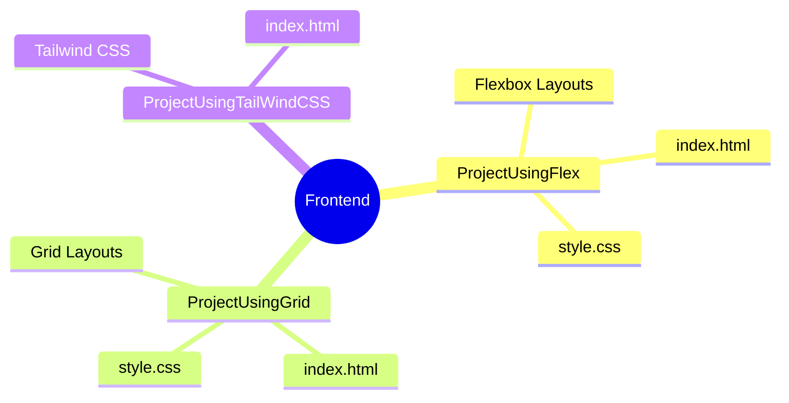

# Frontend Projects Overview

This repository contains various frontend projects demonstrating different CSS layout techniques and frameworks.

## Project Directories

### 1. [ProjectUsingFlex](file:///Users/dheeraj.sonkar/IdeaProjects/frontend/ProjectUsingFlex)
- **Description**: A project focused on demonstrating layouts using **CSS Flexbox**.
- **Contents**:
    - `index.html`
    - `style.css`

### 2. [ProjectUsingGrid](file:///Users/dheeraj.sonkar/IdeaProjects/frontend/ProjectUsingGrid)
- **Description**: A project focused on demonstrating layouts using **CSS Grid**.
- **Contents**:
    - `index.html`
    - `style.css`

### 3. [ProjectUsingTailWindCSS](file:///Users/dheeraj.sonkar/IdeaProjects/frontend/ProjectUsingTailWindCSS)
- **Description**: A project focused on demonstrating modern styling using **Tailwind CSS**.
- **Contents**:
    - `index.html` (includes Tailwind configuration/utility classes)

---
*_______________________________*
